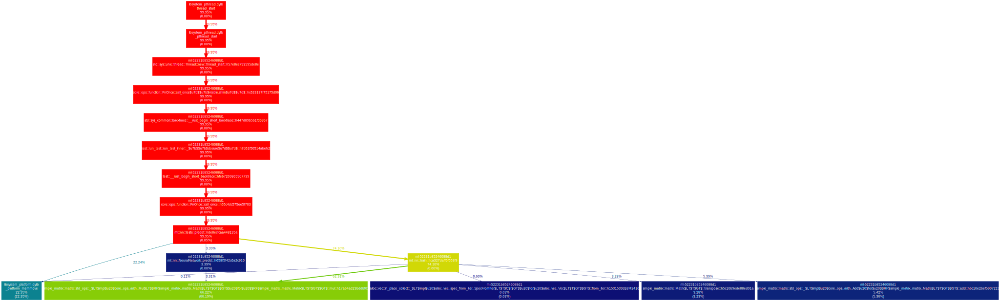

## dotgraph

Only works with `dtrace` on macOS at the moment.

You need Python 3.8+ and Deno =1.30.2 (>1.30.2 won't work).

### Installation

```
deno install -Afq --unstable --reload -n dotgraph https://raw.githubusercontent.com/littledivy/dotgraph/main/dotgraph.ts
```

### Usage

Here's an example with a simple neural network (train + predict).

```
$ dotgraph "target/release/naive-mnist-nn"

$ ls
dotgraph.dot
dotgraph.stacks
dotgraph.svg
```


